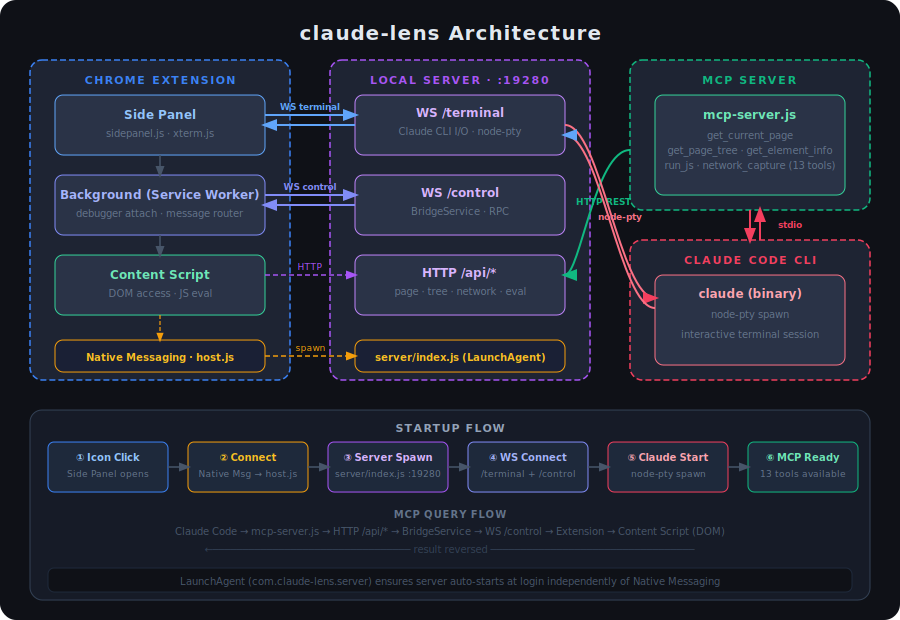
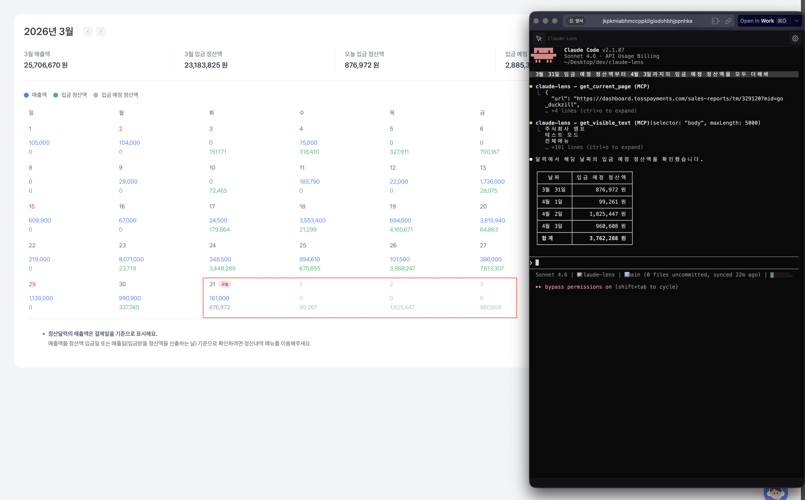
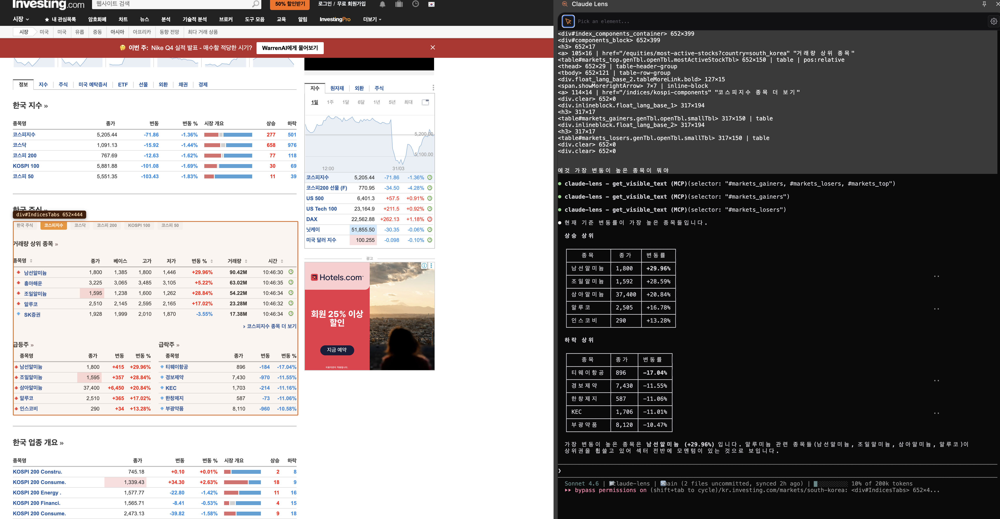

# Claude Lens

> Chrome 사이드 패널에서 Claude Code CLI를 실행하고, 현재 탭의 DOM을 MCP로 Claude에게 제공하는 확장 프로그램.

**[English](README.md)**

---



---

## 데모

<!-- 스크린샷/영상 추가 예정 -->



<!-- 데모 영상 -->
<!--  -->
<!-- <video src="docs/images/demo.mp4" controls width="100%"></video> -->

---

## 사전 요구사항

- **macOS** (LaunchAgent 사용)
- **Node.js** 18+
- **Claude Code CLI** — `npm install -g @anthropic-ai/claude-code`
- **Chrome** 또는 Chromium 기반 브라우저 (Arc, Brave, Edge 등)

---

## 설치

### 1. 클론 & 확장 프로그램 로드

```bash
git clone https://github.com/KooYS/claude-lens.git
cd claude-lens
```

1. Chrome에서 `chrome://extensions` 열기
2. **개발자 모드** 활성화 (우측 상단 토글)
3. **압축 해제된 항목 로드** 클릭 → 프로젝트 루트 폴더 선택
4. Extension ID 확인 (`manifest.json`의 `key` 필드로 고정 — 재로드해도 동일)

### 2. 인스톨러 실행

```bash
cd native-host
./install.sh
```

이 스크립트가 자동으로 처리하는 항목:
- 서버 npm 의존성 설치
- **Native Messaging Host** 등록 (Chrome이 서버를 실행할 수 있도록)
- **LaunchAgent** 등록 (로그인 시 서버 자동 시작)
- `~/.claude/settings.json`에 **MCP 서버** 등록

### 3. Chrome 재시작

Native Messaging 인식을 위해 설치 후 **Chrome을 완전히 종료 후 재시작**해야 합니다.

---

## 사용법

### 연결하기

1. 툴바의 **Claude Lens 아이콘** 클릭 → 사이드 패널 열림
2. **톱니바퀴 아이콘**으로 설정 열기:
   | 설정 | 설명 |
   |------|------|
   | Server Port | 로컬 서버 포트 (기본값: `19280`) |
   | Claude CLI | `claude` 바이너리 경로 (`which claude`로 자동 탐지) |
   | Working Directory | Claude 세션이 시작될 디렉토리 |
   | Font Size / Theme | 터미널 외관 |
   | Skip Permissions | `--dangerously-skip-permissions` 플래그 토글 |
3. **Connect** 클릭 → 서버 자동 시작 + Claude 세션 연결
4. 설정 변경 시: **톱니바퀴 아이콘** → 수정 → 재연결

### MCP 도구

Claude Code 세션 안에서 현재 Chrome 탭을 조회하는 도구:

| 도구 | 설명 |
|------|------|
| `get_current_page` | 활성 탭의 URL, 제목 |
| `get_page_summary` | DOM 구조 분석 |
| `get_page_tree(depth)` | 컴포넌트 트리 (기본 depth: 4) |
| `get_visible_text(selector)` | 요소의 텍스트 읽기 |
| `get_input_values` | 모든 폼 입력값 |
| `get_element_info(selector)` | 요소 스타일, 크기 정보 |
| `get_element_html(selector)` | 요소의 Raw HTML |
| `get_layout_info` | Flex/Grid 레이아웃 감지 |
| `run_js_on_page(code)` | 페이지에서 JS 실행 |
| `start_network_capture` | 네트워크 요청 캡처 시작 |
| `get_network_requests(type?, urlPattern?, statusCode?, limit?)` | 캡처된 요청 조회 |
| `get_network_response_body(requestId)` | 응답 본문 조회 |
| `stop_network_capture` | 캡처 중지 및 디버거 해제 |

---

## 제거

```bash
cd native-host
./uninstall.sh
```

Native Messaging 등록, LaunchAgent, `~/.claude/settings.json`의 MCP 항목을 제거하고 실행 중인 서버 프로세스를 종료합니다.

---

## 주의사항 & 트러블슈팅

> 아래 내용으로 해결되지 않는 문제는 **0seo4207@gmail.com** 으로 연락 주세요.

**Connect 시 서버가 시작되지 않는 경우**
- `./install.sh` 실행 여부 및 Chrome 재시작 여부를 확인하세요.
- 로그 확인: `tail -f /tmp/claude-lens-server.log`
- 수동 시작: `cd server && node index.js`

**`claude` 바이너리를 찾지 못하는 경우**
- 터미널에서 `which claude` 실행 후 결과를 Settings → Claude CLI에 붙여넣으세요.
- 또는 Claude Code CLI 설치 후 `./install.sh`를 다시 실행하세요.

**Extension ID 불일치**
- Extension ID는 `manifest.json`의 `key` 필드로 고정됩니다. 직접 fork한 경우 ID를 인스톨러에 전달하세요: `./install.sh <your-extension-id>`

**포트 충돌**
- Settings에서 포트를 변경한 뒤, 서버를 재시작(`launchctl unload/load`)하고 패널에서 재연결하세요.

**네트워크 캡처가 동작하지 않는 경우**
- Chrome 디버거는 탭당 하나만 연결할 수 있습니다. 같은 탭에서 DevTools가 열려 있으면 닫아주세요.
