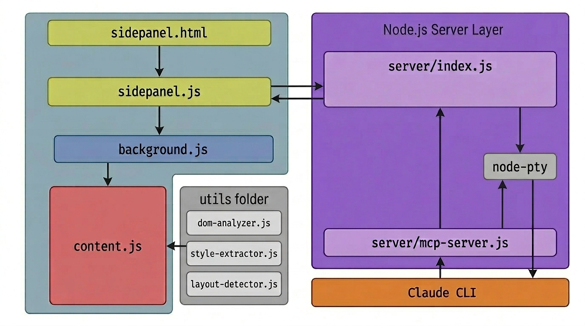

# Claude Lens

Chrome Side Panel에서 Claude Code CLI를 실행하고, 현재 보고 있는 웹페이지의 DOM을 Claude에게 MCP로 제공하는 확장프로그램.



## Prerequisites

- **Node.js** 18+
- **Claude CLI** (`npm install -g @anthropic-ai/claude-code`)
- **Chrome** or Chromium-based browser

## Installation

### 1. Clone & Install

```bash
git clone https://github.com/your-repo/claude-lens.git
cd claude-lens
cd server && npm install && cd ..
```

### 2. Load Extension

1. Chrome에서 `chrome://extensions` 열기
2. **Developer Mode** 활성화 (우측 상단 토글)
3. **Load unpacked** 클릭 → 프로젝트 루트 폴더 선택

> Extension ID는 `manifest.json`의 `key` 필드로 고정되어 있어, 삭제/재로드해도 항상 동일합니다.

### 3. Run Installer

```bash
cd native-host
./install.sh
```

이 스크립트가 자동으로:
- Chrome Native Messaging Host 등록 (Connect 버튼으로 서버 자동 시작)
- `.mcp.json` 생성 (Claude Code에서 MCP 도구 사용)

### 4. Restart Chrome

Native Messaging을 인식하려면 Chrome을 **완전히 종료 후 재시작**해야 합니다.

## Usage

### Side Panel

1. 툴바의 Claude Lens 아이콘 클릭 → Side Panel 열림
2. Settings에서 구성:
   - **Server Port** — 서버 포트 (기본: 19280)
   - **Claude CLI** — 바이너리 경로 (`which claude`로 자동 탐지, 클릭하여 변경)
   - **Working Directory** — Claude가 작업할 디렉토리
   - **Font Size / Theme** — 터미널 외관
   - **Skip Permissions** — `--dangerously-skip-permissions` 플래그 토글
3. **Connect** 클릭 → 서버 자동 시작 + Claude 세션 연결
4. 톱니바퀴 버튼 → 세션 종료 + 설정 변경 + 재연결

### MCP Tools

Claude Code 세션 내에서 현재 Chrome 탭을 조회하는 도구:

| Tool | Description |
|------|-------------|
| `get_current_page` | 현재 탭의 URL, 제목 |
| `get_visible_text(selector)` | 요소의 텍스트 읽기 |
| `get_input_values` | 폼 입력값 조회 |
| `get_element_info(selector)` | 요소 상세 정보 (스타일, 크기) |
| `get_element_html(selector)` | 요소의 HTML |
| `get_page_summary` | DOM 구조 분석 |
| `get_page_tree(depth)` | 컴포넌트 트리 |
| `get_layout_info` | Flex/Grid 레이아웃 감지 |
| `run_js_on_page(code)` | 페이지에서 JS 실행 |
| `start_network_capture` | 네트워크 요청 캡처 시작 |
| `get_network_requests` | 캡처된 요청 조회 |
| `get_network_response_body(requestId)` | 응답 본문 조회 |
| `stop_network_capture` | 캡처 중지 |

## Project Structure

```
claude-lens/
├── manifest.json              # Chrome Extension manifest
├── background.js              # Service worker
├── content.js                 # Content script entry
├── sidepanel.html/js/css      # Side panel UI
├── extension/
│   ├── panel/                 # Side panel 레이어
│   │   ├── view/              # TerminalView, StatusView
│   │   ├── service/           # TerminalService, ControlService
│   │   └── feature/           # PickerFeature
│   └── content-script/        # Content script 레이어
│       ├── feature/           # Inspector, TreeBuilder
│       ├── handler/           # Message handler
│       └── util/              # Selector util
├── server/                    # Node.js 로컬 서버
│   ├── index.js               # HTTP + WebSocket 서버
│   ├── mcp-server.js          # MCP 서버 (Claude Code용)
│   ├── controller/            # API, WebSocket 컨트롤러
│   └── service/               # Claude, Bridge 서비스
├── native-host/               # Chrome Native Messaging
│   ├── install.sh             # 설치 스크립트
│   ├── host.sh                # 셸 래퍼
│   └── host.js                # 서버 프로세스 관리
├── utils/                     # DOM 분석 유틸리티
└── libs/                      # xterm.js 번들
```

## Configuration

### Environment Variables (Server)

| Variable | Default | Description |
|----------|---------|-------------|
| `PORT` | `19280` | 서버 포트 |
| `CLAUDE_BIN` | auto-detect | Claude CLI 경로 |
| `CLAUDE_LENS_PORT` | `19280` | MCP 서버가 참조하는 포트 |

### Chrome Storage (Extension)

Side Panel 설정 화면에서 변경 가능. `chrome.storage.local`에 저장되어 세션 간 유지.

## Manual Server Start

Native Messaging 없이 서버를 수동으로 실행할 수도 있습니다:

```bash
cd server
npm start
# 또는
PORT=19280 node index.js
```

이 경우 Side Panel에서 Connect 시 이미 실행 중인 서버에 연결됩니다.
